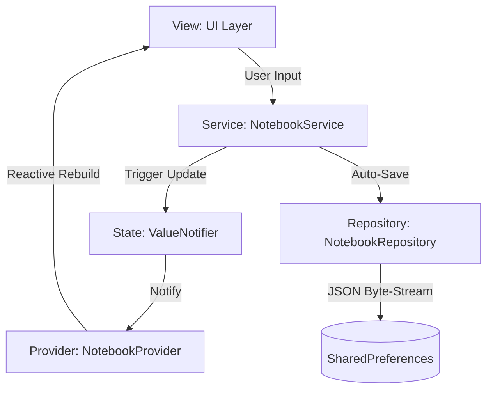

# 📝 Little-Notebook (buku_kecilku) - Informatics Technical Overview

**Little-Notebook** (buku_kecilku) is a mobile-first digital annotation platform engineered with a focus on low-latency state synchronization and robust local persistence. The project demonstrates advanced usage of Flutter's reactive primitives to maintain a unidirectional data flow without external state management overhead.

---

## 🏛️ System Architecture

The application implements a decoupled Service-Repository pattern, leveraging Flutter's native `InheritedWidget` for optimal state propagation and lifecycle management.

### 🛰️ Technical Stack Specs
| Component | Technology | Implementation Detail |
| :--- | :--- | :--- |
| **Rendering Engine** | Flutter SDK | High-performance Skia/Impeller-based UI rendering |
| **State Propagation** | `InheritedWidget` | Efficient O(1) context-based state retrieval |
| **Reactive State** | `ValueNotifier` | Low-overhead listener notification system |
| **Data Persistence** | `SharedPreferences` | Persistent key-value store for JSON-serialized collections |
| **Logic Layer** | Static Services | Pure functional service logic to handle mutations |

---

## 💾 Informatics Implementation Highlights

### 1. State Management Pattern
The application eschews heavy state management libraries in favor of a **ValueNotifier-InheritedWidget** synergy:
- **Centralized Registry**: `NotebookProvider` wraps the root widget tree, providing access to the `ValueNotifier<List<Notebook>>`.
- **Reactive Updates**: Mutations via `NotebookService` update the notifier's value, triggering precise UI rebuilds across the dependency graph.

### 2. Scalable Data Persistence
A robust serialization pipeline ensures data integrity across application lifecycles:
- **Repository Abstraction**: `NotebookRepository` encapsulates all I/O operations, converting nested object graphs to flattened JSON strings.
- **Auto-Save Integrity**: The service layer initiates an asynchronous persistence routine after every state mutation, minimizing the risk of data loss on unexpected termination.

### 3. Modular UI Components
- **Thematic Consistency**: Implements a dedicated `ThemeController` (Singleton) to manage system-wide lighting modes (Light/Dark).
- **Navigation Flow**: Decoupled view architecture (Splash -> Dashboard -> Creator), maintaining a clean separation between UI state and business models.

---

## 📊 Data Schema Reference

The system operates on a hierarchical entity model structured for high-speed serialization:

| Entity | Field | Data Type | Description |
| :--- | :--- | :--- | :--- |
| **Notebook** | `title` | `String` | Unique name for the notebook collection |
| | `content` | `String` | Primary text payload for the notebook |
| | `ideas` | `List<Idea>` | Array of nested granular thought objects |
| **Idea** | `text` | `String` | Individual idea/thought content |
| | `createdAt` | `DateTime` | ISO-8601 formatted creation timestamp |

---

## 🎨 System Design Principles

- **Primary Colors**: Vibrant Purple (`#6B4EE6`) & Teal Accent (`#00C4CC`).
- **Surface Geometry**: Modern Material 3 cards with subtle elevation and rounded corners.
- **UX Logic**: Focus on "Master-Detail" interaction patterns to categorize ideas within notebooks.

---

> [!NOTE]  
> This project serves as a technical blueprint for implementing high-performance local mobile applications using only Flutter's native design patterns and minimal external dependencies.
